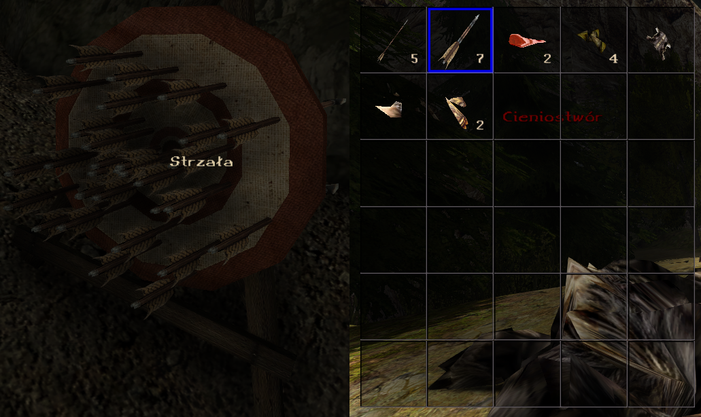

# PickableArrows - Union Plugin [Gothic I/G1A/G2/G2NotR]



PickableArrows is a Union plugin for Gothic I/G1A/G2/G2NotR that allows players to recover and reuse fired arrows and bolts. This plugin adds arrow recovery mechanics to the game, making ranged combat more strategic and resource-conscious.

## Features

- **Arrow Recovery from NPCs**: Arrows that hit enemies are added to their inventory and can be looted from dead or unconscious NPCs
- **Ground Arrow Pickup**: Arrows that miss their target fall to the ground and can be picked up
- **Configurable Recovery Chances**: Set separate recovery chances for ground pickup and NPC inventory (default 100%)
- **Skill-Based Recovery**: Optional skill-based recovery system where your best bow/crossbow skill determines recovery chance (disables manual percentage settings and may be incompatible with some mods) 
- **Full Game Support**: Compatible with Gothic I Classic, Gothic I Addon, Gothic II Classic, and Gothic II NotR, also with mods like The Chronicles Of Myrtana: Archolos and plugins like Free Aim

## Installation

1. Download the latest release from the [Releases](../../releases) page
2. Extract `PickableArrows.vdf` to your `[Gothic]\Data\Plugins` folder
3. Launch Gothic - the plugin will load automatically

## Usage

### Basic Mechanics
- **Arrows hitting NPCs**: Automatically added to their inventory (if enabled)
- **Arrows missing targets**: Drop to the ground as pickable items (if enabled)
- **Recovery chances**: Configurable percentage chance for both ground and NPC recovery
- **Skill integration**: Optional skill-based recovery system

### Recovery System
The plugin uses a probability-based system to determine if arrows are recoverable:
- **Ground Recovery**: When arrows hit terrain, they have a chance to spawn as ground items
- **NPC Recovery**: When arrows hit NPCs, they have a chance to be added to the NPC's inventory
- **Skill-Based**: Optionally use your best bow/crossbow skill as the recovery percentage (disables manual percentage settings and may be incompatible with some mods)

## Configuration

### Through Union Menu (Recommended)

1. Launch the game
2. Go to Main Menu → Options → Union
3. Find "PickableArrows" in the list
4. Configure all options through the graphical interface

### Through Gothic.ini (Alternative)

```ini
[PICKABLE_ARROWS]
Enabled=1
GroundRecoveryChance=100
NpcRecoveryChance=100
AllowNpcInventoryPickup=1
AllowGroundPickup=1
RequireDamageForNpcRecovery=1
ChanceDependsOnSkills=0
```

### Configuration Options

| Option | Description | Default | Values |
|--------|-------------|---------|---------|
| `Enabled` | Enable/disable the entire plugin | 1 | 0=disabled, 1=enabled |
| `GroundRecoveryChance` | Chance to recover arrows from ground (0-100%) | 100 | 0-100 |
| `NpcRecoveryChance` | Chance to recover arrows from NPCs (0-100%) | 100 | 0-100 |
| `AllowNpcInventoryPickup` | Add arrows to NPC inventory when hit | 1 | 0=disabled, 1=enabled |
| `AllowGroundPickup` | Drop arrows on ground when missing the target | 1 | 0=disabled, 1=enabled |
| `RequireDamageForNpcRecovery` | Require damage dealt for NPC recovery | 1 | 0=disabled, 1=enabled |
| `ChanceDependsOnSkills` | Use bow/crossbow skill as recovery chance (disables manual percentage settings and may be incompatible with some mods) | 0 | 0=disabled, 1=enabled |

### Detailed Option Explanations

#### Enabled
Controls whether the plugin is active. When disabled, arrows behave normally (disappear after use).

#### GroundRecoveryChance / NpcRecoveryChance
Percentage chance (0-100) that an arrow will be recoverable. Set to 0 for no recovery, 100 for guaranteed recovery.

#### AllowNpcInventoryPickup
When enabled, arrows that hit NPCs are added to their inventory and can be looted. When disabled, arrows hitting NPCs are lost.

#### AllowGroundPickup
When enabled, arrows that miss targets drop to the ground as pickable items. When disabled, missed arrows are lost.

#### RequireDamageForNpcRecovery
When enabled, arrows are only added to NPC inventory if they actually deal damage. Arrows that hit the target but deal no damage are not recoverable.

#### ChanceDependsOnSkills
When enabled, ignores the fixed recovery chance values and instead uses your highest bow/crossbow skill percentage as the recovery chance. This option disables manual percentage adjustment and may be incompatible with mods that modify skill systems. Integrates with BonusIndependentTraining plugin if available.

## Building from Source

### Prerequisites
- Visual Studio 2019 or later
- Union SDK v1.0m

### Build Steps
1. Clone this repository
2. Copy ZenGin folder from Union SDK to `PickableArrows/ZenGin/`
3. Open `PickableArrows.sln` in Visual Studio
4. Select "MP x4 MT Release" configuration
5. Build the solution
6. Find the compiled DLL in the `Bin/` folder

## Credits

### Development
- **Plugin Author** - PickableArrows Union implementation
- **Union Team** - For the excellent Union SDK framework
- **Gothic Community** - For continued support and testing

## License

MIT License

## Compatibility

- **Gothic I Classic**: ✅ Supported
- **Gothic I Addon**: ✅ Supported
- **Gothic II Classic**: ✅ Supported  
- **Gothic II NotR**: ✅ Supported
- **The Chronicles Of Myrtana: Archolos**: ✅ Supported
- **Free Aim**: ✅ Tested with 2 Free Aim Union plugins and worked
- **BonusIndependentTraining-Union**: ✅ Supported
- **Other Plugins**: Compatible with most Union plugins

## Troubleshooting

### Plugin Not Loading
- Ensure `PickableArrows.vdf` is in the correct folder: `[Gothic]\Data\Plugins`
- Check that Union is properly installed
- Verify Gothic version compatibility
- Check Gothic.ini configuration syntax

### Arrows Not Being Recovered
- Verify that `Enabled=1` in Gothic.ini
- Check that recovery chances are above 0
- Ensure `AllowNpcInventoryPickup` or `AllowGroundPickup` are enabled
- If using skill-based recovery, check your bow/crossbow skill level

### Performance Issues
- Lower recovery chances if experiencing lag with many arrows
- Consider disabling ground pickup in areas with frequent combat

## Contributing

This is a community project. Feel free to:
- Report bugs in the [Issues](../../issues) section
- Submit improvements via Pull Requests
- Share feedback and suggestions
- Test with different Gothic versions and mods

## Version History

- **v1.0.0** - Initial release
  - Full arrow recovery system
  - Configurable recovery chances
  - Support for all Gothic versions
  - Union menu integration
  - Skill-based recovery option
  - BonusIndependentTraining integration

---

**Note**: This plugin modifies game balance by making arrows recoverable. Consider adjusting recovery chances based on your preferred difficulty level.
